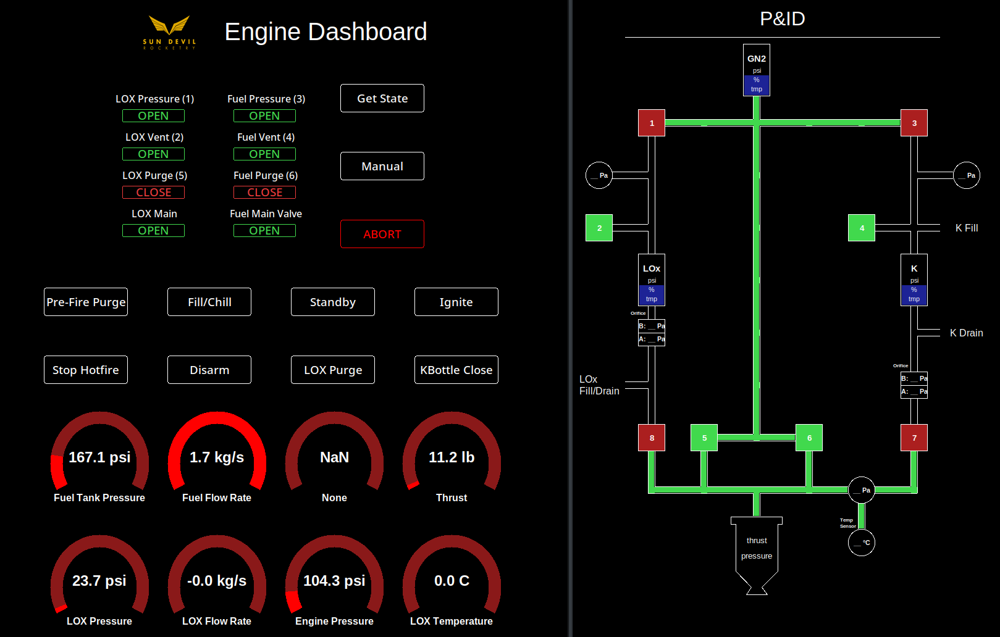

# Rocket Engine GUI
This branch has the goal of creating an easy executable installer for the liquid_engine_gui.

## Important Notice
This branch should **NOT** be merged until:
1. The new directory structure has been verified to introduce no new bugs.
2. The Windows installer is functional.

## TODO

- [x]  Change directory structure to conventional Python3 module
- [x]  Create pysetup.toml
- [x]  Remove sdec submodule and update documentation saying that sdec is installed with pip.
- [ ] (Currently WIP) Setup packaging (perhaps through something as simple as pyinstall to make one EXE, but it could also be an installer that 1. sets up a Python environment, 2. installs SDR software, 3. Installs a .BAT that executes our applications with the installed Python)

## Packing Project getting started
1) Navigate into project folder.
2) Install dependencies, which are Pillow and sdec (technically there are others, but they're all required by sdec as well). ```pip3 install pillow git+https://github.com/SunDevilRocketry/sdec```
3) Run the GUI with the following command: ```python3 -m liquid_engine_gui```

## NOTE: The docs below are very out of date and need updating.

## Getting Started
1) Open cmd / terminal
2) Navigate into the project folder
3) Ensure all required libraries are downloaded (pip install -r requirements.txt)
4) Run main program (python SDR_LiquidGUI.py)
5) Connect Arduino running SDR_DataLogger_Analog.ino via USB port

The following code on this repository has been designed to control the SDR Liquid Engine Switchbox to:
- Automate Rocket Engine Startup
- Display Rocket Engine State
- Log Sensor Data
- Have Pre-programmed actions to execute (i.e. Startup)

## GUI Layout


