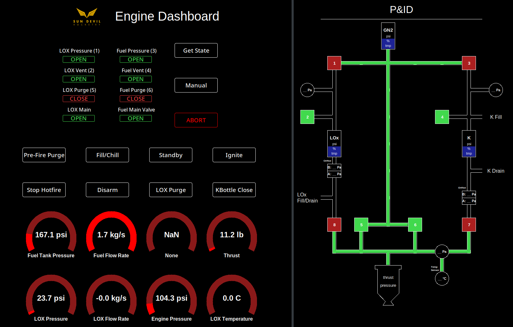

# Rocket Engine GUI


The Liquid Engine GUI is a visual control and monitoring software for the SDR Liquid Engine Valve controller, written in Python using Tk and our [sdec](https://github.com/SunDevilRocketry/sdec) library.

The following code on this repository has been designed to control the SDR Liquid Engine Switchbox to:
- Automate Rocket Engine Startup
- Display Rocket Engine State
- Log Sensor Data
- Have Pre-programmed actions to execute (i.e. Startup)

## Installation
> In the near future, we intend to have an installer application for, at the minimum, Microsoft Windows. For now, the installation process 
1. Make sure you have a working Python installation with pip.
2. Install the GUI with pip.

        pip install git+https://github.com/SunDevilRocketry/liquid_engine_gui
3. Run the GUI with the following command:

        python -m liquid_engine_gui
> If you are developing the software, make sure you don't execute this command in the same directory as the repository, or you may experience bugs.

## Development
The source code is under the directory liquid_engine_gui. The versioning convention is the same as SDEC.

Normally, sdec is automatically pulled with pip. However, it is also included as a submodule in this repo should you be working on sdec development. To test changes to sdec and/or liquids gui, pull your submodules, then use the repo as the current directory and run:

```python3 -m liquid_engine_gui```

This project uses Tk and sdec as a library.

