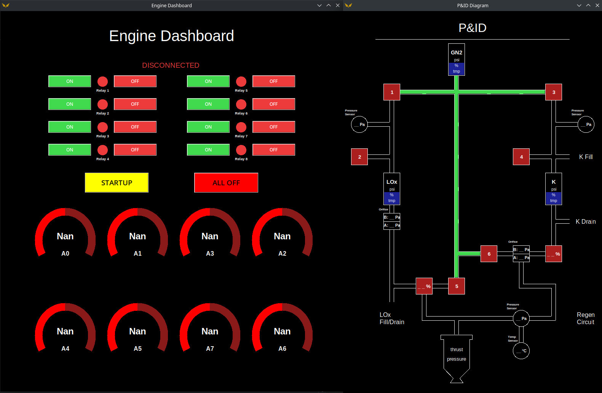

# Rocket Engine GUI
## Getting Started
1) Open cmd / terminal
2) Navigate into the project folder
3) Ensure all required libraries are downloaded (pip install -r requirements.txt)
4) Run main program (python SDR_LiquidGUI.py)
5) Connect Arduino running SDR_DataLogger_Analog.ino via USB port

The following code on this repository has been designed to control the SDR Liquid Engine Switchbox to:
- Automate Rocket Engine Startup
- Display Rocket Engine State
- Log Sensor Data
- Have Pre-programmed actions to execute (i.e. Startup)

## GUI Layout

**Arduino Boards required for com port auto detection. If arduino is not connected, GUI will not allow actuation.
